# 1.todolist

在本章节将会介绍微信小程序开发的入门知识，并且详细地介绍如何实现并发布一个todolist（待办事项）小程序。

## 1.1小程序入门

### 1.1.1 小程序是什么？

   + 本质上来说，微信小程序跟web和app是一样的，都是一种客户端，是一种用户交互的载体。
   但是小程序开发并不只是有客户端的代码就可以的，现实中的小程序绝大多数都是要包括客户端和服务端的。
   由浅入深，本章节将首先介绍一个纯客户端的小程序是如何实现的。
   
   + 开发上来说，微信小程序开发像极了web开发的，技术栈是javascript/wxml/wxss。如果你熟悉web开发，上手微信小程序对你来说将不是难事。
   如果你还拥有vue的开发经验，你将感到小程序开发是多么的似曾相识。
   
   + 原理上来说，一个微信小程序是一个代码包，代码包里打包了javascript/wxml/wxss的代码。
   这个代码包可以运行在三个不同的环境上，ios、android以及小程序开发者工具上。
  

>  *运行原理*
>    
>  微信小程序的运行环境包含两个层
>      在ios上，小程序的javascript代码运行在 JavaScriptCore 中
>      在android上，小程序的javascript是通过 X5 内核来解析
>      在

   
### 1.1.2 开发的准备工作
  
   + 需要在微信公众平台（mp.weixin.qq.com）上注册一个账号。微信公众平台最重要的功能是发布你的小程序，只有发布小程序并通过审核之后的，
   你的小程序才能被其他用户在微信中搜索到并使用。
   
   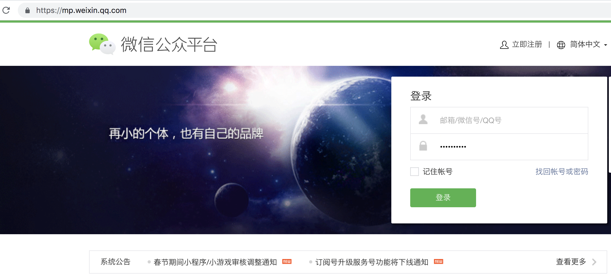
   
   邮箱注册登录之后，会进行小程序主体的选择。
   
   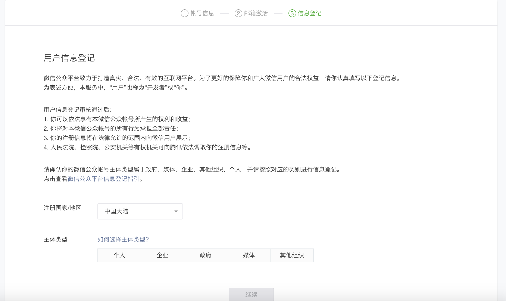
   
   主体类型包括个人，企业，政府，媒体和其他组织五种，不同的主体选择会有不同的功能限制。这里建议一般读者选择个人主体即可。
   
      
> **主体选择的区别** 
> 
> 
> 选择不同的主体都需要提交相关的资料，比如说选择个人主体需要提交用户的真实身份证信息，选择企业主体的话需要提交公司的营业执照等信息。
> 此外，个人主体和非个人主体的服务类目也有较大区别。非个体的部分服务类目还需要提供更多的附加材料，比如"文娱-小说-电子书"服务，需要提供《互联网出版许可证》等材料。
> 除了提交资料之外，如果需要使用更多功能（如支付功能），还需要进行微信认证。暂时个人主体不支持微信认证，这也就意味着个人主体的小程序很多功能是无法使用的。
> 
>
> | 主体类型  | 申请微信认证 | 使用微信支付 | 开发者上限 | 「附近的小程序」展示
> | ----- | ----- | ----- | ----- | ----- |
> | 个人  | ☓   |  ☓   | 10   | ☓   |
> | 企业（未认证）  |  √ |   ☓   | 10   | ☓   |
> | 企业（已认证）  |  √ |   √   | 20   | √   |
> 
> _**政府、媒体和其他组织与企业相类似_
>            
> 微信认证需要提交材料到第三方认证并缴纳一定的费用，现在的定价是300元的手续费。并且微信认证并不是永久有效的，每年需要缴纳费用保持微信认证资格。
> 
> 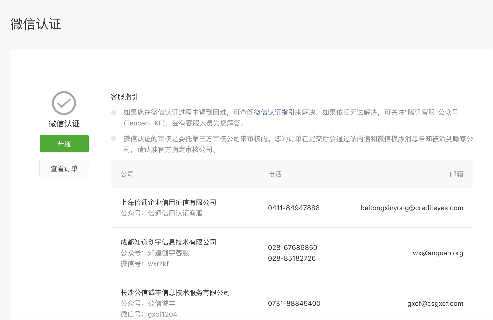
> 
> 对于未微信认证的小程序，暂时发现的受限制功能如下：
> 1. 微信支付功能
> 2. 卡券功能
> 3.「附近的小程序」功能
> 4. 获取微信用户绑定的手机号码
> 
> 除上述功能之外，其他功能是能够同样的使用的。大部分的读者可能无法完成微信认证，为了满足读者的需要，这些受限制的功能在后面的章节中也会进行介绍。


   而当你的小程序上线之后，如果需要变更主体，小程序官方提供了小程序主体迁移功能，但是手续也并不简单。因此如果你的小程序需要长远发展（尤其涉及到商业方面），在选择主体的时候需要慎重考虑。
    
> **主体迁移**
> 主体有几个注意事项，详细信息可以参考官方文档（http://kf.qq.com/faq/180830iEVNVB180830ZRvMVJ.html）
> 1. 目前只支持个人主体迁移到组织主体，组织主体迁移到组织主体。目标主体不支持为个人类型。
> 2. 跟微信认证类似，无论迁移是否成功，小程序的迁移需要缴纳300元手续费。
> 3. 开通了微信支付的小程序在迁移之前，需要先解绑原来的商户账号。为了保持支付不中断，建议先绑定信的商户账户，再解绑原主体的商户号
>
> 如果不选择使用主体迁移功能，可以在原有小程序上引导用户跳转至新的小程序。
> 但是使用这种"人肉迁移"的方式，在迁移过程中不可避免的会造成数据流失和用户流失。首先因为微信小程序用UnionID来识别不同的用户，但是在不同的
> 的主体下，即使是相同的用户的UnionID也并不相同。所以"人肉迁移"后只能通过其他的方式映射新老小程序的用户数据了。其次，这种引导用户跳转到新小程序的过程中，需要
> 用户每次手动点击确定，这几乎是必然地带来一部分用户流失。

   可以看到微信公众平台上提供了很多功能。功能主要划分为主要有管理、统计、功能、开发、推广和设置板块，
   具体的使用场景在后续章节中会结合示例小程序进行详细介绍。
   
   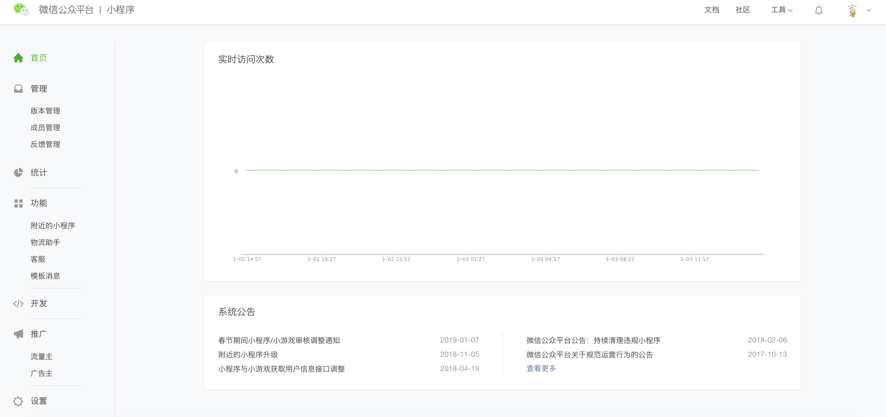
   
   + 下载微信小程序开发工具
   
   注册完微信公众平台账号之后，在开始小程序的开发之前，我们还需要下载微信官方提供的小程序开发工具，官方下载地址（https://developers.weixin.qq.com/miniprogram/dev/devtools/download.html）。
   在后面的章节中，会结合示例来介绍微信开发工具的使用。 
    

## 1.2 开发TODOLIST

这一节中，我们将详细介绍如何实现一个纯客户端的todolist小程序。
在微信小程序中搜索“20天之todolist”或者扫描下图二维码，可以进行体验最终效果。完整代码可以在github(https://github.com/tostoy/20-todolist)上下载。

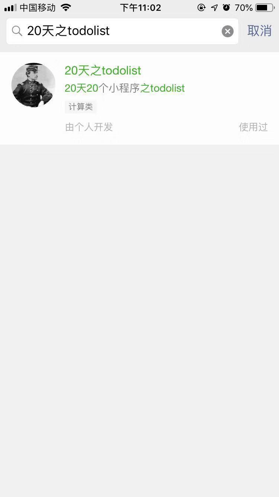 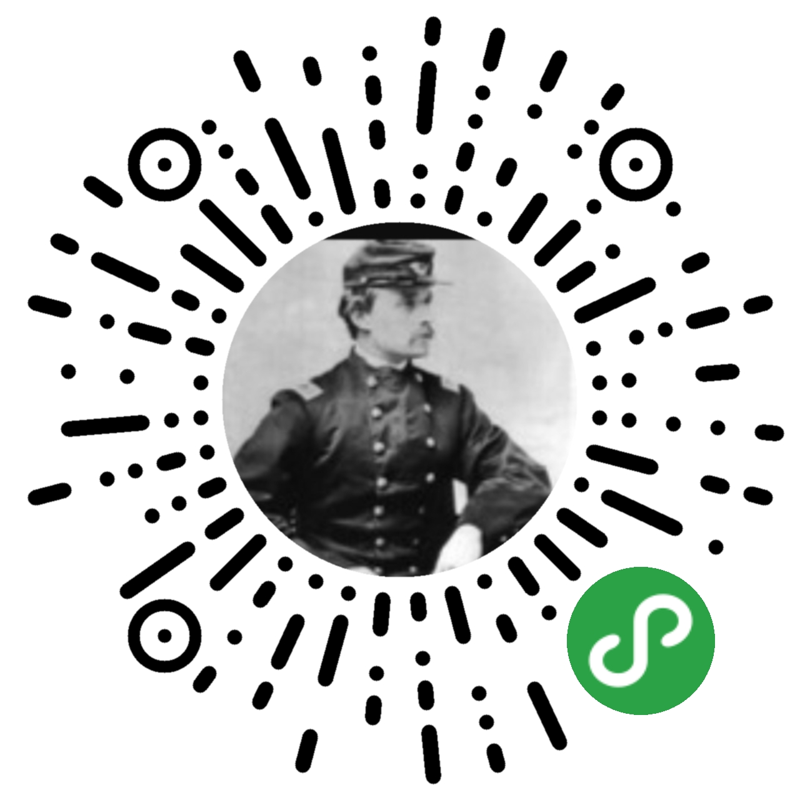


    
我们最终所要实现的效果图如下:
    
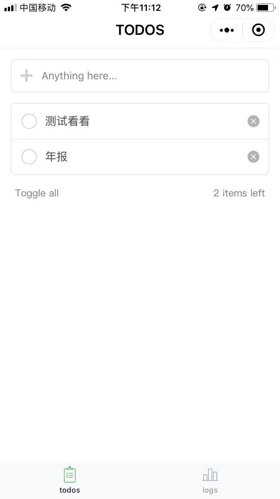    
  


### 创建项目

首先打开微信开发工具，点击"+"位置新建项目。

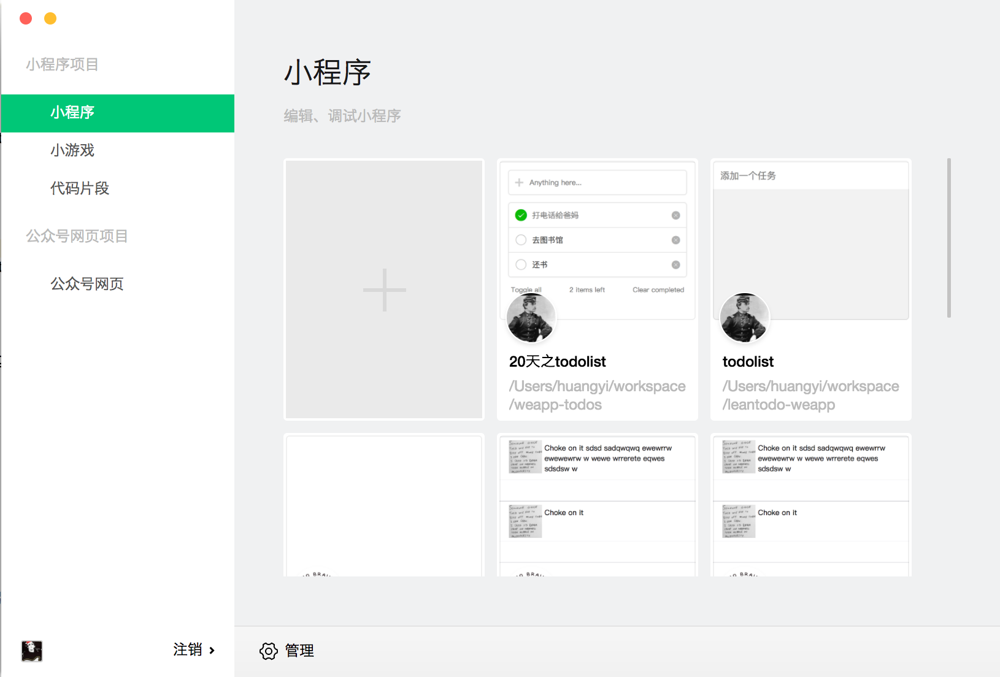  

然后进入配置填写界面，注意其中appID应当填入微信公众平台的「开发-开发设置-开发者ID里」的appID。

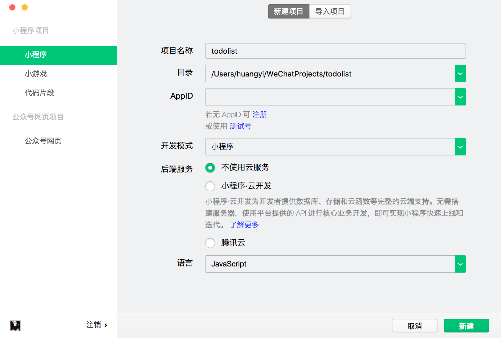 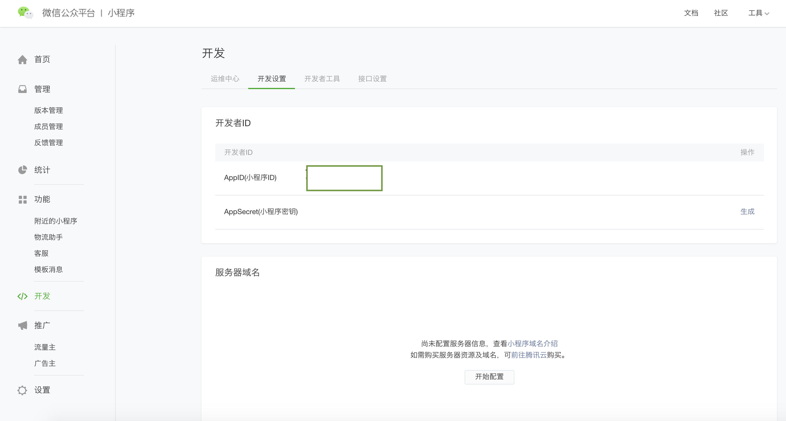      

进入开发工具页面，可以看到跟chrome浏览器的开发者工具很像。

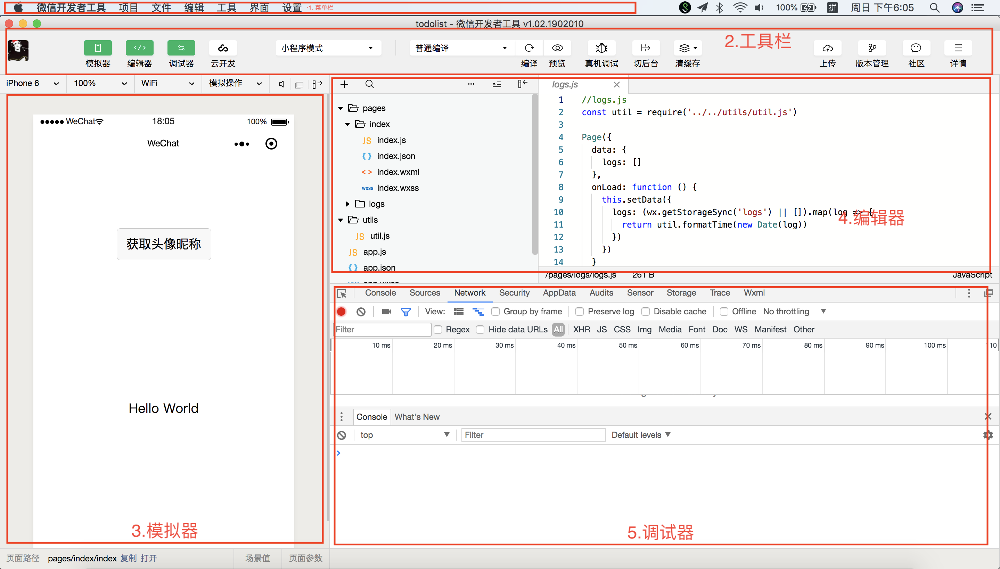    

```
1. 菜单栏
    
  并不常用，最主要的功能包括项目新建/打开、工具栏设置以及界面外观操作的设置。
         
2. 工具栏

  开发中经常需要使用，包括小程序编译、清空缓存、上传代码等重要功能。  

3. 模拟器

  模拟器可以模拟小程序在微信客户端的表现。小程序的代码通过编译后可以在模拟器上直接运行。
  开发者可以选择不同的设备，也可以添加自定义设备来调试小程序在不同尺寸机型上的适配问题
   
4. 编辑器

  左边是树型结构的文件导航栏，右边是选中文件的内容编辑器。  

5. 调试器

  这一部分跟chrome浏览器的调试器很像，大多数tab项在开发调试中都起到很重要的作用。
  

```
  
创建项目之后，开发者工具自动生成了「hello world」样例代码。
在编辑器中，可以看到样例代码有四种类型文件。熟悉网页编程的人都直到，网页编程采用的是 HTML + CSS + JS 这样的组合，其中 `HTML` 是用来描述当前这个页面的结构，`CSS` 用来描述页面的样子，`JS` 通常是用来处理这个页面和用户的交互。
小程序类似地提供了 WXML + WXSS + JS 的组合。

| 文件类型 | 必填 |  作用 |
| ------  | ---  |  ----  |
| js  | 是  |  页面逻辑层  |
| wxml  | 是  | 页面视图  |
| wxss  | 否 | 页面样式  |
| json  | 否  | 页面配置  |


同时我们也可以看到小程序代码典型结构。


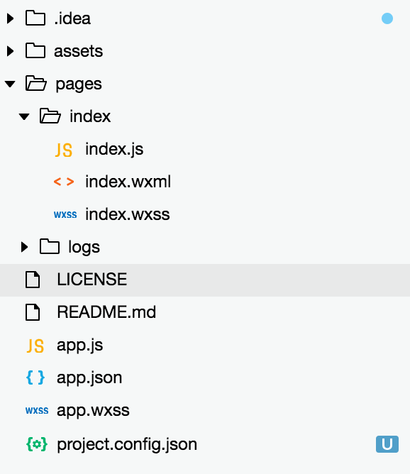    


1. 工具配置 project.config.json 

   小程序开发者工具在每个项目的根目录都会生成一个 project.config.json，主要是与业务无关的开发者工具的相关配置，其中会包括编辑器的颜色、代码上传时自动压缩等等一系列选项。
    
2. 小程序配置 app.json
    
   `app.json` 是当前小程序的全局配置，包括了小程序的所有页面路径、界面表现、网络超时时间、底部 tab 等。
    样例代码中的 `app.json` 配置内容如下：
    
    ```json
    {
      "pages":[
        "pages/index/index",
        "pages/logs/logs"
      ],
      "window":{
        "backgroundTextStyle":"light",
        "navigationBarBackgroundColor": "#fff",
        "navigationBarTitleText": "WeChat",
        "navigationBarTextStyle":"black"
      }
    }

    ```
    其中`pages`字段表示当前小程序的所有路径，第一个路径是小程序打开时的默认路径。`window`字段定义了页面顶部的全局配置，包括颜色文字是否加粗。        

3. 页面配置 pages/index/index.json

    与`app.json`类似，只是`pages/index/index.json`位于单个页面的文件目录下，表示当前页面路径的顶部配置。
    
4. 小程序样式 app.wxss 

   `wxss`文件具有`css`大部分的特性，在`app.wxss`中定义了全局样式。样例代码中 `app.wxss` 内容如下：
   ```css
    /**app.wxss**/
    .container {
      height: 100%;
      display: flex;
      flex-direction: column;
      align-items: center;
      justify-content: space-between;
      padding: 200rpx 0;
      box-sizing: border-box;
    } 
    ```
    可以看到与普通的 `css` 文件很接近，其中一个细微的不同是 ``` padding: 200rpx 0;```，小程序新增了尺寸单位`rpx`。
    
>     *rpx与px概念*
>      在h5开发中， rpx的意思是responsive pixel
>      可见在不同设备下， 35px和35rpx的区别。
>      （图片）
>      微信规定屏幕宽为750rpx。
>      简单来说，rpx iphone6的设备宽高比为750 * 1334，如果设计给出的基于iphon6的设计来说
>     
   
   
5. 页面样式 pages/index/index.wxss
    
    与 `app.wxss` 类似，`pages/index/index.wxss`位于单个页面的文件目录下，表示当前页面路径的局部样式。

6. 页面视图 pages/index/index.wxml

    `wxml`语法和`html`非常接近，增加了小程序特有的标签和属性。
    样例代码中`index.wxml` 内容如下：
    
    ```html
    <!--index.wxml-->
    <view class="container">
      <view class="userinfo">
        <button wx:if="{{!hasUserInfo && canIUse}}" open-type="getUserInfo" bindgetuserinfo="getUserInfo"> 获取头像昵称 </button>
        <block wx:else>
          <image bindtap="bindViewTap" class="userinfo-avatar" src="{{userInfo.avatarUrl}}" mode="cover"></image>
          <text class="userinfo-nickname">{{userInfo.nickName}}</text>
        </block>
      </view>
      <view class="usermotto">
        <text class="user-motto">{{motto}}</text>
      </view>
    </view>

    ```  
    如果你了解MVVM开放模式的框架(如Vue，React)，对 `wxml`的代码就会感到熟悉。
    其中
    
    
    
  
7. 小程序逻辑 app.js
   

8. 页面逻辑 pages/index/index.js
       
    
其中页面由以下这几个部分组成。

index.js
index.wxml
.wxss 


1. 首先我们需要一个列表功能。

2. 增加add button

3. 状态变化

## 1.3 发布TODOLIST

# 参考资料

微信小程序认证有哪些主体类别？  https://www.sohu.com/a/165305873_99940999

主体功能差异 http://blog.sina.com.cn/s/blog_ed7dae4a0102xjb2.html

微信小程序原理 http://eux.baidu.com/blog/fe/%E5%BE%AE%E4%BF%A1%E5%B0%8F%E7%A8%8B%E5%BA%8F%E6%9E%B6%E6%9E%84%E5%8E%9F%E7%90%86

开发者工具 https://blog.csdn.net/qq_17470165/article/details/80200857

https://blog.csdn.net/u012767761/article/details/81151830

架构原理 https://juejin.im/entry/5b8de6b7f265da432f655528
