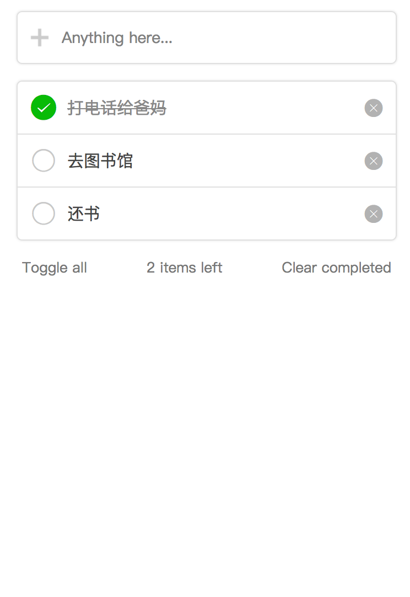

# todolist

在本章节将会介绍微信小程序开发的入门知识，并且详细地介绍如何实现一个todolist（待办事项）小程序。

## 小程序入门

1. 小程序是什么？

   + 本质上来说，微信小程序跟web和app是一样的，都是一种客户端，是一种用户交互的载体。
   但是小程序开发并不只是有客户端的代码就可以的，现实中的小程序绝大多数都是要包括客户端和服务端的。
   由浅入深，本章节将首先介绍一个纯客户端的小程序是如何实现的。
   
   + 原理上来说，微信小程序是运行在
   
   ```
   底层实现原理

    ```
   + 开发上来说，微信小程序像极了web开发的。如果你熟悉web开发，上手微信小程序对你来说将不是难事。
   如果你还拥有vue的开发经验，你将感到小程序开发是多么的似曾相识。
   
   
2. 开发的准备工作
  
   + 需要在微信公众平台（mp.weixin.qq.com）上注册一个账号。
   
   
   
   邮箱注册登录之后，会进行小程序主体的选择。
   
   ```
   主体选择的区别

    ```
   可以看到微信公众平台上提供了很多功能。
   

3. 


小程序 介绍基本概念
* 准备工作
* wxml wxss
```
rpx与px概念
在h5开发中， rpx的意思是responsive pixel
可见在不同设备下， 35px和35rpx的区别。
（图片）
微信规定屏幕宽为750rpx。
简单来说，rpx iphone6的设备宽高比为750 * 1334，如果设计给出的基于iphon6的设计来说
```
* 
* 框架介绍 wepy mpvue和taro
* 

## todolist

一个简单的todolist的设计图是如下这样的。



1. 首先我们需要一个列表功能。

2. 增加add button

3. 状态变化


# 
代码可以在以下地址下载，同时在微信小程序中可以搜索20天之todolist即可使用。